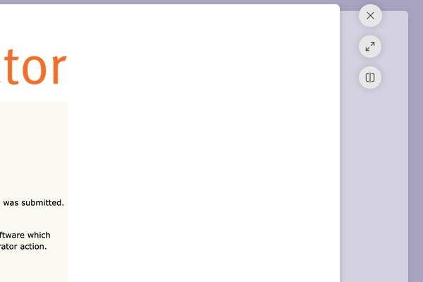
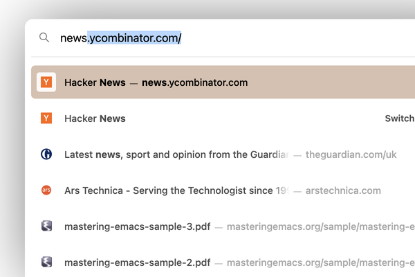

# Zen Browser Mods

My modes for the Zen Browser. Install from the [official Zen Mods page](https://zen-browser.app/mods).  
Comments and suggestions are welcome.

 

## Glance Buttons

Move the glance window buttons to the right and fix the colors in the default light/dark themes.

 

## URL Bar

Remove the inner border from the URL bar panel for a cleaner look.

